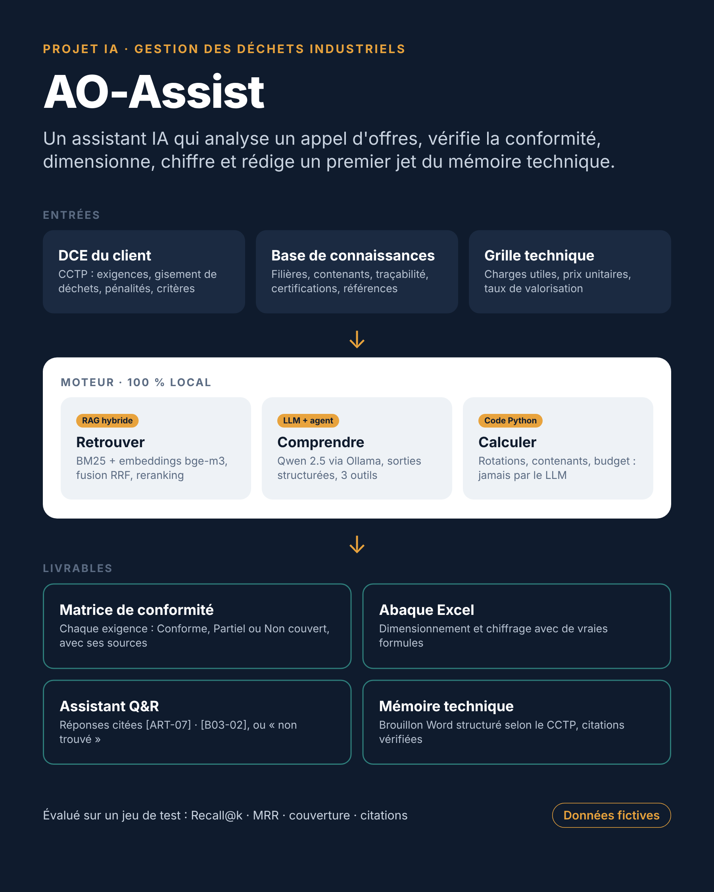

# ♻️ AO-Assist

**Un assistant IA qui aide un bureau d'études à répondre aux appels d'offres de gestion des déchets industriels** : il analyse le DCE, vérifie la conformité de l'offre, dimensionne et chiffre la prestation, répond aux questions des commerciaux et rédige un premier jet du mémoire technique. Le tout en local, avec des modèles open source, et évalué sur un jeu de test.



> Toutes les données du projet (client, prestataire, tonnages, prix) sont **fictives**.

## Le problème

Répondre à un appel d'offres industriel prend des jours : lire un CCTP article par article, n'oublier aucune exigence, vérifier ce que l'entreprise sait réellement faire, dimensionner les contenants et les rotations pour chaque flux, chiffrer, puis rédiger un mémoire technique cohérent. Une exigence manquée, un délai mal compris ou une erreur de calcul peut coûter le marché.

## Ce que fait AO-Assist

| Étape | Livrable | Technique |
|---|---|---|
| 1. Analyse du DCE | liste structurée des exigences (catégorie, niveau, valeur cible) | LLM + sortie structurée Pydantic |
| 2. Conformité | matrice Conforme / Partiel / Non couvert, avec justification et sources | RAG hybride sur la base interne |
| 3. Dimensionnement et chiffrage | rotations, contenants, budget, taux de valorisation ; **abaque Excel avec formules** | calcul Python déterministe + openpyxl |
| 4. Assistant | réponses sourcées aux questions des commerciaux | agent LangChain à 3 outils |
| 5. Mémoire technique | brouillon Word suivant le plan exigé par le CCTP, avec points de vigilance | génération ancrée + vérification des citations |
| 6. Évaluation | Recall@k, MRR, couverture, exactitude des statuts, citations valides | jeu de test annoté |

## Choix de conception

- **Les chiffres ne viennent jamais du LLM.** Le dimensionnement est du code Python testé, exposé à l'agent comme un outil. Le classeur Excel reprend le même calcul en formules, modifiables sans Python.
- **Tout est sourcé.** Chaque affirmation cite l'article du CCTP `[ART-07]`, la fiche interne `[B03-02]` ou le calcul `[DIM]`, et les citations sont contrôlées automatiquement.
- **Le droit de dire « je ne sais pas ».** L'assistant répond « je n'ai pas trouvé » plutôt que d'inventer, et le mémoire signale `[À COMPLÉTER]` ce que la base ne couvre pas.
- **Une recherche choisie par la mesure.** Quatre stratégies sont comparées sur 20 questions reformulées : BM25 adapté au français, embeddings multilingues bge-m3, hybride (fusion RRF) et reranking par cross-encoder. Sur ce corpus, la recherche dense seule gagne, et c'est elle qui est retenue. Un filtre par corpus sépare le DCE du client et la base interne.
- **Découpage par article.** Un CCTP est structuré : chaque article est une unité citable.
- **Confidentialité.** Ollama, Qwen 2.5 et bge-m3 tournent en local : aucun document commercial ne quitte la machine.
- **Mesurer plutôt que croire.** Chaque brique est évaluée séparément, avec des questions reformulées comme un commercial les poserait.

## Résultats

Résultats obtenus sur le cas fictif, GPU T4 de Google Colab :

| Indicateur | Valeur |
|---|---|
| Exigences extraites du CCTP | _à compléter_ |
| Couverture des exigences clés | _à compléter_ |
| Statuts de conformité corrects | _à compléter_ |
| Recall@3 de la recherche (meilleur mode) | _à compléter_ |
| Réponses correctes de l'assistant | _à compléter_ |
| Citations valides | _à compléter_ |
| Durée analyse + matrice + mémoire | _à compléter_ |

Le tableau est rempli par la dernière cellule du notebook (section 14).

## Lancer le projet

1. Ouvrir `AO_Assist.ipynb` dans Google Colab.
2. *Exécution → Modifier le type d'exécution → GPU T4*.
3. *Exécution → Tout exécuter* (15 à 25 minutes).
4. Les livrables sont écrits dans `sorties/` : `offre_FVO.xlsx`, `memoire_technique_brouillon.docx`, `tableau_de_bord.png`.

Les données sont recréées par le notebook lui-même : aucun fichier à téléverser.

## Structure

```
ao-assist/
├── AO_Assist.ipynb              # le notebook complet
├── data/
│   ├── dce/CCTP_FVO.md          # CCTP fictif, 17 articles
│   └── base/                    # base de connaissances fictive du prestataire + grille de prix
├── assets/architecture.png
├── build_notebook.py            # génère le notebook à partir des sources
└── tests/                       # exécution complète hors Colab avec modèles simulés
```

## Transposition dans Microsoft 365

| AO-Assist | Équivalent Microsoft 365 |
|---|---|
| dossier `data/base/` | bibliothèque SharePoint de la base de connaissances |
| agent LangChain + outils | agent Copilot Studio avec sources de connaissance et actions |
| extraction et export de la matrice | flux Power Automate déclenché au dépôt d'un DCE |
| classeur Excel | source d'un tableau de bord Power BI de suivi des appels d'offres |

La méthode reste la même : extraire, comparer, sourcer, calculer par du code et mesurer.

## Limites

- Données fictives et jeu de test réduit : à valider sur de vrais DCE anonymisés.
- Un modèle de 7 milliards de paramètres peut se tromper sur un statut : la matrice aide à décider, elle ne décide pas.
- Pas encore de lecture de PDF ni de bordereaux de prix (BPU, DPGF) : prochaine étape avec Docling ou PyMuPDF4LLM.

## Stack

Python · LangChain · Ollama (Qwen 2.5 7B, bge-m3) · sentence-transformers (bge-reranker-v2-m3) · Pydantic · pandas · openpyxl · python-docx · matplotlib · Google Colab
